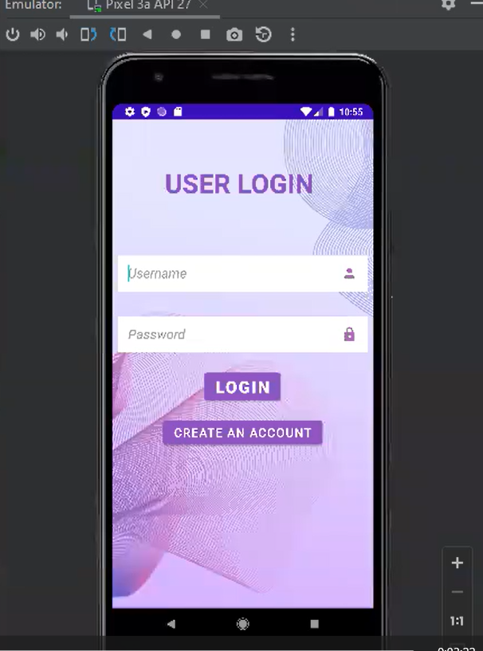

# Full Stack Android Mobile Application

A full-featured mobile application built using **Java**, **Android Studio**, and **Firebase**. This application supports authentication, data persistence, and real-time backend functionality. It was developed over a period of 3 months as part of a course deliverable using **Kanban** methodology for project management.

---

[▶️ Watch Demo Video](https://www.youtube.com/watch?v=your_video_id)

---

## 📋 Quick Overview

This application is a full-stack **University Course Management System** developed for Android. It allows students and faculty to interact with course-related features such as registration, attendance, grading, and communication. The app integrates Firebase for backend services.

---

## 🚀 Features

- 🔐 Secure User Authentication  
- 📦 Cloud-based data storage with Firebase  
- 💾 Offline data persistence  

---

## 🛠️ Built With

- **Java** – Main programming language  
- **Android Studio** – IDE for Android development  
- **Firebase** – Backend-as-a-Service (BaaS)  
- **XML** – For UI layouts  
- **Kanban** – Project management and tracking (Trello/Jira/Notion, specify if needed)

---

